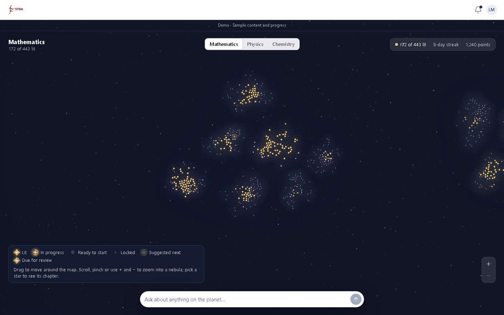
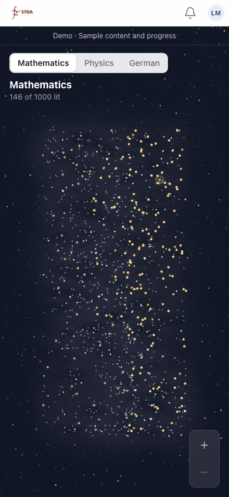

# 一片天空的星图演示（#119、#120、#132、#134、#136；前身 #48 / #109 / #76 / #110）

星图是**一片天空**（ADR 0001）：所有学科都在里面，每个学科是一个**星系**，星系由该学科的**星云**组成，星云里的每颗**星**是一个知识点。默认整片天空 **1000 颗星 / 3 个星系 / 16 团星云**（#116 演示数据集）：数学约 440 颗、物理约 310 颗、化学（没修）约 240 颗。

#110 的星光质感（细密星点、星尘、亮雾，全景知识星 1.15–2.1 px）第一轮验收通过并保留；它「铺满一块」的布局（`demoGalaxyPositions`）第一轮被推翻，#119 已删除，换成下文的星系 → 星云布局。

视觉参考：[ESO 银河中心宽视野照片](https://www.eso.org/public/images/eso0949l/)，只借鉴细密星光、亮云与暗尘的层次；本轮重点是成团。场景用原生 Canvas。

## 本地预览

看设计用 #115 的免后端预览（见 `docs/agents/design-preview.md`）：

```bash
npm run dev -- --host 127.0.0.1 --port 5173
```

- `/src/dev/preview.html?surface=map&points=1000`（全景）、`surface=map-nebula`（三角函数星云）、`surface=map-star`（演示知识点）；`points=10|1000|2000`。
- 连线（#121）：`surface=map-focus-optics`（全景，键盘聚焦物理「光学」）、`map-focus-star`（三角函数星云，聚焦演示知识点）、`map-optics`（光学星云）、`map-refraction`（锁定的 Refraction，星层）。预览通过星图数据源接缝（`starMapSource.ts`，#131）注入演示天空并带上它的前置（含跨学科）；正式路由没有演示天空，只有空星图。
- 任意路由：`/src/dev/preview.html?path=/map/physics?points=2000`；`/map/chemistry` 看没修的星系。
- 截图对照：`npm run design-preview:capture -- --base http://127.0.0.1:5173 --label <集>`，再开 `/src/dev/preview-compare.html?mode=shots&surface=map&before=before-119&after=after-119`。

计帧台架仍是 `/src/dev/starmap.html?host=ask&path=/map/math&points=2000&bench=1`（#44 的面板；它没接预览的拦截层，通知组件会请求本地后端）。`&foveation=on|off`、`&relations=fixture`（显示整片天空的前置，含跨学科）、`&longNames=1` 同前。

## 无级缩放（#134）

星图不再有「全景 / 星云层 / 星层」三个停靠点：缩放完全连续、不吸附。三者只描述缩放大致所在的区段（舞台上的 `data-zoom-band`：`panorama` / `nebula` / `star`）。下文其他小节里的「全景层 / 星云层 / 星层」凡指缩放程度的，读作这三个区段；凡指路由的，读作「什么都没选 / 选了星云 / 选了星」。

**输入 → 引擎 → 显示**

- **滚轮 / 触控板**（`StarMapView` 的 `wheel` 监听 → `engine.wheelBy`）：按滚动量连续缩放，以光标为中心（光标下的地图点不动），`log2(缩放) = −deltaY × 0.003`，一格鼠标约 ×1.23；触控板捏合（ctrl+wheel）×10。没有累积阈值、没有冷却。缩放先进一个「待走的缩放量」，按 90 ms 时间常数逐帧逼近（所以一格一格的鼠标也是一段平滑的缩放），最快 ×64/秒。
- **捏合**：两指按下时抓住两指中点下的地图点，之后缩放 = 起始缩放 × 两指距离比，那个地图点始终在两指中点下（缩放与平移一起）；松手时还在捏，就按松手速度继续缩放、200 ms 时间常数减速（惯性）。
- **+ / − 按钮与键盘 + / −**：每次 ×1.5，绕视野焦点（选了星时就是这颗星），同样平滑逼近；连按叠加。**双击 / 双点**空处 ×2（第一下若已选中星云或星，飞行本身就是放大，第二下不再叠加）。
- **范围**：最小 = 今天的全景（`panoramaZoom`，且不低于 #120 的 `ringSafeZoom`）；最大 = 星形 40 px。到头时对应按钮置灰。
- **reduced motion**：没有任何惯性 / 逼近，滚轮、按钮、双击直接到位；选择时的飞行仍是 200 ms 交叉淡化。
- **随缩放出现的内容**都是缩放的连续、单调函数（smoothstep 在两个阈值之间），由引擎每帧算好交给渲染器（`frameState`）：星形大小（9–40 px；小号与大号两种画法在 28–32 px 之间交叉淡化，小号在 12–30 px 之间先缩到与大号同大，所以放大时星形只会变大）、星点 → 星形、星名、星云名、四档连线、桥、选中星时其余变暗、技能点。名字因为位置不够而得到 / 失去位置时淡入淡出（180 ms），并尽量保持上一帧的位置与方位，不闪烁。

**可调的数（一处：`src/features/starmap/view/semanticZoom.ts`）**

`ZOOM`（相机怎么动）与 `REVEAL`（什么时候出现）。缩放程度一律用 `starPx`：星形此刻应画多大（px，不截断），手机与桌面读法相同。第一版数值：

| 内容 | 阈值（`REVEAL`） |
| --- | --- |
| 星名淡入 | `starNameIn` 14 → 18 px；先给离视野焦点近的：可得名的半径 = 视口短边 × 0.18 → 1.2（随星形 14 → 32 px 增大），最外 0.12 渐隐；同屏最多 80 个 |
| 星云名淡入 | 星云屏上半径 `nebulaNameIn` 150 → 230 px，且缩放已离开全景 `nebulaNamePastPanorama` ×1.15 → ×1.45（全景仍只给悬停 / 聚焦的那团，#123） |
| 星云名让位 | `nebulaNameOut` 星形 18 → 24 px 淡出 |
| ①② 档连线淡入、全景的桥淡出 | `linesNear` 8 → 12 px |
| ③ 档 | `linesWalked` 12 → 18 px |
| ④ 档（锁定，虚线） | `linesLocked` 28 → 34 px |
| 星点 → 星形 | 星形 18 → 26 px（原 `dotBlendFor`）；全景处一律星点，离开全景 `dotsPastPanorama` ×1 → ×1.5 才按大小换 |
| 能点到单颗星（点按、Tab） | `starsPickableFrom` 14 px 且已不是全景的星点；推荐星任何缩放都能点、都是完整星形 |
| 选中星时其余变暗、只剩它的线 | `starFocus` 12 → 20 px |
| 技能点 | `skills` 28 → 32 px |
| 星卡片因缩小而关闭 | 星形 < `cardClosesBelow` 12 px |
| 选中的星云因缩小而放开 | 缩放回到全景的 `panoramaBand` ×1.25 以内 |

`ZOOM`：`wheelPerPx` 0.003、`glideMs` 90、`maxRate` 6（log2/秒）、`pinchDecayMs` 200、`buttonStep` 1.5、`doubleTapStep` 2、`maxGlyph` 40、`flightMs` 600、`nebulaGlyph` 28（点星云飞到的大小）、`starGlyph` 34（点星飞到的大小）。

**地址与星卡片跟「选中了什么」走（Z2）**

- 滚轮 / 捏合 / 按钮 / 双击不改地址。
- 点星云（星还小到不能单独点时，点到哪团就是哪团）→ `/map/<学科>/<星云>`，镜头连续飞过去（d3 式插值），拉近到 28 px 星形。点星（星形 ≥ 14 px 时）→ 这颗星的地址、星卡片打开、飞到至少 34 px（不会为了打开星而拉远）。
- 星卡片关闭：Escape（焦点在地图里，或页面上什么都没聚焦）、卡片的「返回」、点空处（没点到任何星）、或缩小到星形 < 12 px。关闭只把地址改回星云，**镜头不动**。继续缩小到全景，星云也放开，地址回到 `/map/<学科>`，之后标题照旧跟随视野中心的星系。左上角「← 星图」是唯一会飞回全景的「放开」。
- 旧链接 `/map/:subjectId/:topicId/:unitId` 直接打开到那颗星、34 px、在卡片旁。
- 选中 / 放开时其余星云变暗（0.6）与选中星的暗化都按 140 ms 缓入缓出，不在一帧里切换。
- 三个地图路由现在是同一个页面组件（`MapPage`，`routeManifest.ts`）。原来每层一个页面组件，换层时 React 把整张星图卸载重建：所谓的层间飞行在真实页面里从没播过，每次都是一帧黑屏加直接跳到新视野。

**保住的**：环（缩放时跨接缝不跳变，测试逐帧核对）、任意缩放下都能拖（#132 的星层平移就是选了星时的拖动）、点亮动画（`starOnScreen` 每帧读引擎坐标）、切换器飞行与标题跟随、键盘（Tab：缩放到能点单颗星后屏上的星都是 Tab 停靠点；← / → 照旧）、对比度门禁、生产排除。

**连续帧**：`node scripts/design-preview-zoom-frames.mjs --base http://127.0.0.1:5173 --label <集>`（`--scenarios zoom,choose`、`--points`、`--viewports`）。用 Chrome 的 screencast 录下浏览器真实画出的每一帧，存成 `.codex-screenshots/design-preview/<集>/<场景>-<视口>-<星数>/NNNN.jpg` 与每 30 帧一张的对照表，并打印相邻帧的差异（跳变就是尖峰）。`zoom`：桌面滚轮、手机双指捏合从全景推到最近，点一颗星，再拉回全景；`choose`：点星云、点星、Escape、按三次 −、双击、按两次 +。

**帧时间**（`node scripts/starmap-zoom-frametime.mjs`，台架生产构建，无界面 Chromium 关闭垂直同步，390×844 @1x，2000 颗，每 16 ms 滚 ±10 px、1.8 秒进 1.8 秒出、共 10 秒，只计地图真的画了的帧，3 次取 p95 中位数；改前 `871ec24` 与本票同一次会话）：

| | 改前 p95 ms | 改后 p95 ms |
| --- | --- | --- |
| 连续缩放 | 1.2（1.2 / 1.2 / 1.2；最慢单帧约 108 ms） | 4.0（4.1 / 4.0 / 3.9；最慢单帧约 12 ms） |
| 平移（每 16 ms 左拖 6 px） | 1.9（1.9 / 1.9 / 2.0） | 2.1（2.2 / 2.1 / 2.0） |

改前的「缩放」其实不缩放：滚轮累积到阈值才换层、换层卸载重建整张图（那约 108 ms 的单帧），其余帧都是静止画面的缓存，所以 p95 很低，不可直接比。改后每一帧都在真缩放、光层缓存每帧重画，4 ms 仍远低于 16.7 ms。本机模拟，不是真机。

## 拖星（#136）

拖动一颗星，和它直接相连的星（它的前置与后续，含跨学科，只一跳）被看不见的弹簧拉着跟过去；松手全部弹回原位，带一点余震。什么都不存：星的坐标仍是后端给的布局（#72），位移只在屏幕上。

**输入 → 抓星判定 → 弹簧 → 画**

- **输入**（`StarMapView` → `engine.pointerDown(id, x, y, kind)`，`kind` 来自 `pointerType`：`mouse` / `touch` / `pen`）。
- **抓星判定**（引擎 `grabbable`）：只有缩放到能点中单颗星（`zoom.pickable`，且星形 ≥ `DRAG.grabFromGlyph` 14 px）、没有飞行时，按下处在某颗星的星形范围内（鼠标：星形 × 0.5，至少 10 px；手指：× 0.7，至少 18 px）才算按在星上；否则一律是拖地图（#132），远处缩放时永远是拖地图。
  - 鼠标 / 笔：按在星上、移动超过点按容差（5 px）= 拖星；不动就松开 = 原来的点按（选中、开卡片）。
  - 手指：按住不动 `DRAG.longPressMs` 300 ms = 抓住（星放大到 ×1.22），之后随手拖；300 ms 内先滑动 = 拖地图；快速点一下 = 原来的点按。抓住时长按不会弹出系统菜单（`contextmenu` 被拦、`-webkit-touch-callout: none`）。
  - 拖星永远不是点按：不选中、不改地址、不开卡片。第二根手指按下 = 放开星（弹回）并开始捏合。
- **弹簧**（纯函数 `view/starDrag.ts`）：位移以屏幕 px 计，每帧由引擎加到 `x` / `y` 上，所以命中、连线、名字、并行 DOM 与 `starOnScreen`（点亮层 #51）读到的都是拖动中的位置。
  - 被拖的星每帧放到「手的位置 − 按住点相对星心的偏移」：完全跟手，缩放中（滚轮、触控板捏合照常可用）也停在手下。
  - 相连的星由阻尼弹簧追 `DRAG.followRatio`（60%）× 被拖星的位移，略慢半拍，手停下时轻晃后停住；离被拖星越远的弹簧越软（最多软 35%，600 px 封顶），整张网不是一块硬板。
  - 松手：被拖的星和相连的星都由回弹弹簧拉回 0，过冲约 12%，静止（位移 < 0.05 px、速度 < 2 px/s）时精确归零、拖动结束。
  - reduced motion：没有弹簧——相连的星直接在 60% 处，松手下一帧全部归位，亮线 / 变暗也不缓动。
- **画**（`frame.drag`：被拖的星、相关星、每颗星的位移、亮起程度 `amount`、放大 `grow`）：
  - 被拖的星与相连星之间的线全部亮起（不论档位，④ 档也亮）：在原线之上叠一道亮实线（进推荐星的是金色，其余是 ② 档白），线一直画到另一颗星，随星实时伸缩；其余线降到 0.2、其余星与名字降到 0.4，按 140 ms 缓入、松手后 260 ms 缓出，与弹回一起结束。
  - 被拖的星画在最上层，名字优先、跟着它走（可以压在别的线与星上）。
  - **屏外的相连星**（D6）照样被拉；它的线画到屏幕边缘，边缘标出目的地「↘ Optics · Physics」：星云名，另一学科时加学科名，每团星云一个，取最近的那颗星的方向，不盖住被拖的星。这时 #121 的星云目的地标签让位（前半段缓出、后半段才换成拖星的标签，两套不同时出现）。
  - **接缝**（#120）：线一律走较短的一侧（`shortestDx`），两端各加自己的位移。

**可调的数（一处：`view/semanticZoom.ts` 的 `DRAG`）**

| 数 | 第一版 | 含义 |
| --- | --- | --- |
| `followRatio` | 0.6 | 相连星跟随的比例 |
| `follow` | 刚度 260 /s²，阻尼比 0.42 | 拖动中相连星的弹簧：恒速拖动时约落后 50 ms 的路程，停手过冲约 20% 的落后量 |
| `release` | 刚度 220 /s²，阻尼比 0.55 | 松手回弹：过冲约 12%，约 0.5 s 停稳 |
| `lagSpread` / `lagReachPx` | 0.35 / 600 px | 越远越软 |
| `longPressMs` | 300 | 触屏抓星的长按 |
| `grabFromGlyph` | 14 px | 能抓星的最小星形（#134 的 `starsPickableFrom`） |
| `grabReach` / `grabMinPx`；`touchGrabReach` / `touchGrabMinPx` | 0.5 / 10；0.7 / 18 | 按在星上的范围 |
| `grow` / `growMs` | 1.22 / 90 ms | 抓住时放大 |
| `dimStars` / `dimLines` | 0.4 / 0.2 | 拖动时其余星、线的亮度 |
| `emphasisMs` / `emphasisOutMs` | 140 / 260 ms | 亮线与变暗的缓入 / 缓出 |

**键盘**：拖星没有键盘等价操作；Tab、← / →、+ / −、Escape 都不变。

**连续帧**：`node scripts/design-preview-drag-frames.mjs --base http://127.0.0.1:5173 --label after-136`（`--stars sine,hub,zoom`、`--points 1000|2000`、`--viewports desktop,phone,narrow`，默认 `surface=map-focus-star`）。桌面用鼠标拖，手机长按半秒后拖；`sine` 是演示知识点「Sine and cosine」，`hub` 是屏上相连最多的星，`zoom` 拖住时滚轮放大再缩小。存成 `.codex-screenshots/design-preview/<集>/<星>-<视口>-<星数>/NNNN.jpg` 与对照表，并检查松手后并行 DOM 里每颗星回到原位、零越界请求。`design-preview-flows` 有一条拖星流程（星到了手下、全部回位、地址不变、不开卡片）。

**帧时间**（`node scripts/starmap-zoom-frametime.mjs`，台架生产构建，无界面 Chromium 关闭垂直同步，390×844 @1x，2000 颗，10 秒，3 次取 p95 中位数，同一次会话；拖星在三角函数星云带前置 `--path /map/math/trigonometry --relations`，拖「Sine and cosine」——演示天空里相连最多的星，8 条——每帧 6 px 绕圈，每 2.5 秒松手 0.6 秒让它弹回）：

| | p95 ms |
| --- | --- |
| 平移，全景 `/map/math`（#134 的读法） | 2.6（2.6 / 2.4 / 2.6） |
| 平移，同一星云视野带前置（按在空处） | 1.7（1.6 / 1.7 / 1.7） |
| 拖星，同一视野 | 1.7（1.7 / 1.7 / 1.7） |

拖星不劣于同次会话的平移。本机模拟，不是真机。在 Git Bash 里跑要加 `MSYS_NO_PATHCONV=1`，否则 `--path /map/...` 会被改写成 Windows 路径。

**测试**：`tests/component/starmapStarDrag.test.tsx`（只一跳含跨学科、跟手与 60% 跟随与落后、停手轻晃、松手过冲后精确回位、点按仍选中而拖动不选中、空处拖地图、远处只拖地图、触屏滑动 vs 长按、快速点按仍选中、拖住时滚轮缩放星仍在手下、reduced motion、第二根手指、亮线与变暗及恢复、屏外相连星的边缘标签、接缝走短的一侧、`starOnScreen`、键盘焦点、舞台传 `pointerType` 与拦系统菜单）。

## 默认画面

桌面 1440×900 与手机 390×844，1000 颗星，全景层停在数学星系。





## 布局：星系 → 星云 → 星（`layout/layout.ts` 的 `layoutSky`）

- **环带**：所有星系沿 x 依次排在一条水平带上，x ∈ [0, 1]，带子居中于 y = 0.5，坐标保持等比。带子两端各留半个间隙，左右循环（#120，见下文「左右循环」）后接缝处就是又一道同样宽的间隙。
- **星系顺序**：`galaxyOrder` 从第一个学科起，每次把与上一个跨学科前置最多的学科排在旁边——演示数据里是数学 · 物理 · 化学（物理光学以数学三角函数为前置）。循环后最后一个也成了第一个的邻居。
- **星系之间**：间隙为最高星系高度的 0.6 倍，远宽于同一星系里星云之间的暗空（测试锁定：每团星云的最近邻都不到最窄星系间隙的一半）。
- **星系内部**：星云先按前置关系排（`layoutNebulae`，相关主题靠近），半径只随星数变化（整片天空同一密度），再向星系中心收拢（上下拉得更紧，所以星系顺着带子横躺），直到圆盘相切、互不重叠。
- **星云内部**（`cloudStars`）：不是均匀圆盘，而是一个主团加 1–3 个小团的高斯云，按种子压扁、旋转，所以每团形状不同；核心最密、向外渐疏（半径一半以内的星约占一半，均匀圆盘只有四分之一）；最小间距 0.35 倍典型间距，不碰撞也不成格子。`order` 小的星靠近核心并略加混合，所以一团星云从核心开始被点亮。
- 一个种子管所有星数：10 / 500 / 1000 / 2000 档的星系和星云位置不变，只是星的多少不同。

## 画法（`render/galaxy.ts`、`render/canvas2d.ts`）

- **天空底**：平涂 + 微光 + 稀疏星尘（比 #110 稀，让星云之间留暗空）。
- **星系底色**：每个星系一张缓存的雾（宽 1024 px），用该星系的基色调（蓝紫 → 银 → 暖金之间按带子位置分配），透明度 0.04。
- **星云**：每团一张缓存图块（64 / 128 / 256 / 512 档，缩小保留高分辨率），由本团的星画成：每颗星一个柔和的本团色调印记，叠出亮而密的核心、边缘化进暗空；点亮与进行中的星再印一层暖金，点亮越多核心越暖；几道暗纹打破圆团；再加跟随星密度的细颗粒（#110 的星尘质感）。整团透明度 = 0.10 + 0.06 × 点亮比例，所以**点亮比例越高整团越亮**。
- **色调**：每团在所属星系基色附近 ±0.15 取自己的色调，只在蓝紫—银—暖金之间，不用彩虹色。
- **没修的学科**：星系雾、星云、星点都乘 0.4。
- **全景状态**：全景只要认得出「点亮」（暖金点、发光）与「推荐」（每个在修学科一颗，任何缩放都画成完整星形，所在星系在中心时它呼吸）。四种学习状态在星云层用完整 glyph 区分：打开星云时至少放大到 28 px 的 glyph（按最近邻间距算，云核再密也不重叠）。
- **连线**：分层露出、按与学生此刻的相关程度定明暗，见下文「连线（#121）」。
- **缓存**：缩放不变的第二帧起，星系雾与所有星云合成一张比视口四边各大 25% 的图，拖动、惯性、呼吸只移动这张图；换缩放、星状态变化或拖出边距时重画。图块只在本团星状态变化时重画。

## 连线（#121）

亮度表示「这条关系此刻和学生有多相关」，不表示关系存在（#117 D1–D3；用户原话：全局视角下若都是亮线，就成了「一堆线团的乱涂鸦」）。判定在 `model/linkTiers.ts`（纯函数），画法在 `render/links.ts`，`render/canvas2d.ts` 只调用一次 `drawLinks`。

**明暗四档**（按前置两端的学习状态，`linkTier`）：

| 档 | 条件 | 画法（token） |
| --- | --- | --- |
| ① 推荐 | 通往推荐标记的线（终点带推荐标记） | 暖金实线 2 px + 柔光，`--starmap-link-recommended`（金 0.9） |
| ② 进行中 | 进行中知识点连向其前置 | 白 0.5 实线 1.5 px，`--starmap-link-in-progress` |
| ③ 走过的路 | 两端都点亮（及点亮 → 可开始） | 白 0.16 实线 1 px，`--starmap-link-walked` |
| ④ 锁定 | 通向锁定知识点的线（两端都锁定是常见情形） | 白 0.3 虚线 3/4，`--starmap-link-locked`，只在放得很大时（#134） |

**按缩放露出**（`starLineLook` / `bridgeLook` / `galaxyHintLook`；#121 原按层，下面三条的「全景 / 星云层 / 星层」读作缩放区段与选中，见「无级缩放」）：

- **全景**：不画知识点之间的线。同一星系里有前置的两团星云之间至多一座柔光桥：一串柔和光点（径向渐变），两端渐隐进云里，穿过第三团星云核心处减到 1/4，`--starmap-bridge`（0.07）。悬停或键盘聚焦一团星云：它的桥 ×4，其余 ×0.4。星系之间平时没有桥，只在两星系相对的边缘各留一团极淡的光（每对有跨学科前置的星系一处）；聚焦其中一团星云时，它的跨星系桥才亮（例：物理「光学」→ 数学「三角函数」），那处光退到 0.4。
- **星云层**：本星云的线，①–③ 档；连到别的星云的线从本星云的星出发，在本星云屏上半径的 0.4 倍（至少 48 px）内渐隐，只留方向。被连到的星云不在屏上时，在屏幕边缘按方向标出它的名字；属于另一个学科时写成「↘ 光学 · 物理」。键盘聚焦一颗星：只有它的前置与后续保持亮，其余降到 0.15。
- **星层**：这颗星的前置与后续完整亮起（四档都画，画到另一颗星），其余隐去；通往别的星云的线在线旁标出「星云 · 学科」，不放到屏幕边缘（宽屏右侧是星卡）。
- #134 起不再按层切换：四档与桥按缩放交叉淡入淡出（`frame.lineReveal`，阈值见上文「无级缩放」），屏上所有星的线都按缩放出现，不只选中的星云；④ 档只在星形 ≥ 28 px 时淡入；选中星时它的线全部亮起、其余随 `starFocus` 淡出。

**接缝（#120）**：两点之间的线一律走水平方向较短的一侧，`dx = ((xb − xa + 0.5) mod 1) − 0.5`（`shortestDx`），以一端的屏幕位置为锚。`drawLinks(..., { wrap: true })` 时每个形状再在左右各一个带宽处画一次（#120 打开循环后由它传入；现在不传）。

**对比度**：平时可见、表达「现在」的 ①② 档按语义连线 3:1 门禁（`scripts/contrast-pairs.json`，天空上 9.62:1、5.34:1；叠加的星云雾与满点亮云核上由 `starmapContrast` 检查）。③ 档、④ 档与全景的桥有意安静，低于 3:1，以 `gate: false` 记录理由（#121）。

**验收计数**：2000 颗星的全景，平时可见的桥 + 星系间的光 ≤ 有前置的星云对数，知识点级的线为 0（`starmapLinks` 测试，桌面与手机）。截图：`npm run design-preview:capture -- --base http://127.0.0.1:5199 --label after-121 --surfaces map,map-nebula,map-star,map-focus-optics,map-focus-star,map-optics,map-refraction --points 2000 --viewports desktop,phone`，对照页 `/src/dev/preview-compare.html?mode=shots&surface=map-nebula&before=before-121&after=after-121`。

**演示数据**：每颗推荐星加上本星云里它之前的至多两颗点亮星作前置（`withWayIn`，不取随机数、不跨星云，布局不变），否则演示天空里推荐星没有前置，① 档看不到。

**性能**：计帧台架 390×844、2000 颗、无界面关闭垂直同步，拖动 10 秒：不带前置 p95 2.8 / 3.2 ms，带前置（全景画桥）3.5 / 3.0 ms，同一量级（本机模拟，不是真机）。

## 相机与交互

- **全景层 = 对准一个星系的窗口**，不是整条带子：最高星系占控件之间高度的 80%；手机至少看到最宽星系的约 77%（不转成竖条，是同一布局的更窄窗口）。所有星系同一缩放。
- **学科切换器 = 飞到那个星系**：同一片天空不重建，只做一次约 0.75 秒的飞行（d3-zoom 式先拉远再推近），沿环带**较短的一侧**飞（数学 → 化学向左跨过接缝）；其它星系留在原处。
- **标题与「已点亮 N 颗」跟随视野中心的星系**：拖到别的星系、停下后，路由就地换成 `/map/<该学科>`（replace，不进历史），标题、计数、切换器高亮和「上次学科」随之更新。
- **路由**：`/map/:subjectId` 仍可用，含义变为「聚焦该星系」；星云与星的链接挂在它们自己星系的学科下（`/map/physics/optics/...`），跨学科前置的链接也是。路由结构本身不改（#3）。
- 键盘：全景 Tab 按星系顺序逐团星云（星系内按课程顺序，再加屏上的推荐星），每团只出现一次；聚焦一团星云时地图沿较短的一侧平移到它。星云链接上按 ← / → 走到环带上左 / 右相邻的那团（按 x 排），最右一团的 → 跨过接缝到最左一团，反之亦然。并行 DOM 列出屏上所有星。星层：← / → 走到本星云课程顺序的上一颗 / 下一颗星，Escape 回星云层；星被拖出可见区后有「回到这颗星」按钮（#132）。

## 星层平移（#132）

#134 之后「星层」就是「选了一颗星」：拖动规则不变（#136 起按在星上是拖那颗星，按在空处才是拖地图，见「拖星」）；回去的方式按 Z2 改为 Escape、卡片返回、点空处或缩小到 12 px 以下（滚轮 / 捏合不再整层退回）。

星层原来不能拖（「卡片才是要读的」），#120 的「星层同样循环」因此做不到；#132 让星层像其他两层一样平移，沿用同一个环。以下每条都是可以推翻的设计决定（第二轮验收）：

- **拖动 = 平移地图**，与全景层、星云层同一手势、同一惯性，跨接缝不跳变（同一套副本机制，每颗星每帧只有一个位置）。只夹 y，x 沿环一直走。手机竖屏同一布局。
- **星卡片一直开着**，跟着的是路由里的那颗星，不跟视野：拖多远都**留在星层**，不按距离退回星云层。回去靠卡片的「返回 <星云>」、Escape、缩小按钮或滚轮 / 捏合（与原来一样）。
- **这颗星的前置与后续连线（#121 星层规则）跟着它走**：连线锚在画出来的那份星上，所以拖动时一起移动，离屏后也就离屏。
- **离屏提示**：这颗星移出「可见区」（页面控件之间、宽屏卡片左侧 / 手机卡片上方，留 16 px 余量）后，在可见区边缘、朝着它的方向出现一个玻璃按钮「→ 星名」（`data-star-hint`，可 Tab 到，读作「Back to <星名>」）；点它地图沿环**较短的一侧**飞回原位。位置只在地图静止时更新（拖动中不重排 DOM）。拖过半圈后，较短的一侧换到另一边，箭头也随之换向。位置计算是 `view/layers.ts` 的 `starHintSpot`。
- **点击**：点另一颗星 = 换到那颗星（仍在星层，路由更新，飞过去）；点这颗星本身 = 回到原位（同提示按钮）；点空处无动作。命中用引擎的屏幕坐标，所以拖过接缝后点到的也是画出来的那份。
- **方向键**：星层原来没有方向键的含义。现在 ← / → 走到同一星云里课程顺序的上一颗 / 下一颗星（与星云层的 Tab 顺序一致），到头即停、不跨星云；输入框里不拦截。
- 点亮时刻（#51）每帧读 `starOnScreen`，所以动画播放时拖动，光会跟着星走；离屏时不确认，规则不变。

**帧时间**（与 #120 同法：bench 生产构建，无界面 Chromium 关闭垂直同步，390×844 @1x，2000 颗，每帧 6 px 向左拖 10 秒、跨接缝，3 次取 p95 中位数；同一次会话里三层各测一遍）：

| 层 | 聚合 on p95 ms | 聚合 off p95 ms |
| --- | --- | --- |
| 全景 | 6.3 (6.6 / 6.3 / 6.0) | 6.5 (6.5 / 6.6 / 6.1) |
| 星云层 | 4.8 (4.4 / 4.8 / 4.8) | 2.3 (2.4 / 2.3 / 2.3) |
| 星层 | 5.4 (5.4 / 5.4 / 5.4) | 3.1 (2.8 / 3.1 / 3.1) |
| 星层，去掉卡片的背景模糊 | 4.7 (4.6 / 4.7 / 4.8) | 2.6 (2.7 / 2.6 / 2.5) |

星层比星云层多的约 0.6 ms 是星卡片的 `backdrop-filter` 在背后地图移动时每帧重算模糊（去掉模糊后与星云层持平）；JS 采样两层没有差别。星层仍低于同次会话的全景层。本机模拟，不是真机。

**测试**：`tests/component/starmapStarLayerPan.test.tsx`（拖动整体位移且焦点与卡片不变、惯性、跨接缝无跳变并命中 / `starOnScreen` 画出来的那份、点别的星换焦点、点本星回位、回位走短的一侧、提示位置、方向键与 Escape）。

## 左右循环（#120，#117 B3）

环带首尾相接成一个环：一直往右拖会回到最左边的星系。只循环水平方向，垂直仍有边界、上下渐隐成暗空。手机竖屏是同一布局的更窄窗口，左右拖同样循环。

- **坐标**（`view/camera.ts`、`view/sky.ts`）：环的周长 `SKY_WRAP` = 1 个地图单位。视野中心 `cx` 不再夹在带子里，可以一直走下去；静止时把它拉回第一圈（`cx mod 1`），画面不动。`clampView` / `panBy` 带 `wrap` 参数时只夹 `cy`。
- **副本**：每一帧按视野中心给每个星系选一份离它最近的副本（`galaxyTurns`：给星系 x 加整数圈），星系雾、星云、星点跟着同一个星系一起移动。引擎算出的屏幕坐标（`x`、`y`、`nebulaX`）就是画出来的那一份；渲染器只有星系雾按 `frame.galaxyShift` 摆放，并把它算进光层缓存的键。没有为接缝复制数组：每颗星每帧只有一个位置。
- **不出现两次**：一个星系只在它的中心离视野中心半圈时换到另一份副本。`ringSafeZoom` 让窗口从中心向两侧都不超过「半圈 − 最宽星系的伸展（雾 + 云）− 48 px」，所以换副本时它整个在屏幕外，同一个星系永远不会同时出现两次。全景缩放本来就高于这个下限（1000 颗：桌面 2.13 > 1.61，手机 5.87 > 1.88，3440 宽屏 1.59 > 1.55）；切换器的飞行拉远时被限制在这个下限。只有一个星系（或某个星系宽过半圈）时不循环，仍是一条带子。
- **点击、悬停、点亮动画、并行 DOM**：都读引擎的屏幕坐标，所以命中的、`starOnScreen` 交给点亮层的、列进并行 DOM 的都是看得见的那一份，每颗星只列一次。
- **标题跟随**：`galaxyAt` 按环上的距离判断中心所在星系，接缝里的间隙也一样算。
- **星系雾的边**：每个星系的雾图四边各淡出 6%，星云的软笔刷越出雾框也不会在暗空（包括接缝）里留下直边。
- **连线**：跨接缝的连线走短的一侧属于 #121；本票没有改连线绘制，星云层内的线只连本团的星（同一份副本），不受影响。

## 数据

- 星图从**数据源接缝**取数据（#131）：`src/features/starmap/starMapSource.ts` 的 `StarMapSourceContext`，`useStarMap` 只调用 `source.read({ subjectId, size, t, language, relations, longNames })`，形状不变，#48 的读模型接在这里。**生产默认 `emptyStarMapSource`**：空天空、`demo: false`；`StarMapRoute` 见到没有任何学科时不挂渲染器，显示空状态「Your star map is on its way」（四语，`starmap:emptySky.*`），不显示 Demo 横幅，并照常结束登录计时。`demo` 为真时才把 `demo` 传给 `StarMapView`（Demo 横幅、占位星说明）。
- 演示天空在 `src/dev/demo/sky/`（#131 从 `src/features/starmap/fixtures/` 移来）：`demoSky.ts`（#116 的生成器）、`demo-sky.json`、`demoStarMap.ts`（把整片天空交给渲染器，`subject` 只是聚焦的星系、`summary` 是它的点亮数；无论聚焦哪个星系，星与星云数组是同一份，切换器飞行时不重画）、`strings.ts`（演示专用文案 `starmap:demo.notice / emptyStar / longNebula`，已移出 locale 文件）、`source.tsx`（`demoStarMapSource` / `<DemoStarMapSource>`，import 时注册文案）。预览经 `PreviewLighting` 注入（叠加点亮覆盖与长名），台架 `starmap.html` 用 `<DemoStarMapSource>`。
- 渲染器单测、台架、预览都从 `src/dev/demo/sky` 取数据，不从生产代码取；#110 以前的数学单学科夹具（`starMapFixture`、`map-10.json`、`nebula-names.json`）与 `demoGalaxyPositions` 已删除。测试用 `tests/component/starmapHarness.ts` 的 `skyMap(size, subjectId)`；要走真实路由看演示天空的测试用 `<DemoStarMapSource>` 包一层（`deepLinkRefresh`、`starmapProductionSource` 的阳性对照）。生产包里不得出现演示天空的标记，由 `designPreviewExcluded.test.ts` 检查（见 `design-preview.md`「不进生产包」）。
- 只有一颗**演示知识点**（数学 · 三角函数「正弦与余弦」）有章节；其余是**占位星**；**星尘**是装饰，不是数据。

## 验证

- 对比度：最亮处取「星系雾 + 满点亮星云核心」按白色叠加（0.04 + 0.10 + 0.06 = 0.20），文字 4.5:1、锁定环与连线 3:1 仍过（`starmapContrast`）；星云圆盘互不重叠，邻团的光到不了核心（`starmapLayout` 锁定）。
- 全量测试、lint、typecheck、翻译守卫、对比度、release、publisher、生产 build 通过。

## 左右循环的性能对照（#120）

同一台机器、同一方法（#44 面板，无界面 Chromium 关闭垂直同步，390×844 @1x，每组拖 10 秒）；改前是 `ffc6448`（#119 + #51），改后是本票。每组跑 3 次取 p95 的中位数，括号里是三次读数。

| 星数 | 聚合 | 改前 p95 ms | 改后 p95 ms |
| --- | --- | --- | --- |
| 500 | on | 3.6 (3.3 / 3.6 / 4.2) | 3.6 (3.6 / 3.7 / 3.3) |
| 1000 | on | 4.3 (4.0 / 4.9 / 4.3) | 4.2 (5.0 / 4.2 / 4.0) |
| 2000 | on | 5.6 (5.5 / 5.6 / 6.9) | 5.5 (6.4 / 5.5 / 4.8) |
| 500 | off | 3.1 (3.9 / 3.0 / 3.1) | 2.9 (2.9 / 3.3 / 2.7) |
| 1000 | off | 5.1 (5.1 / 3.6 / 8.6) | 3.9 (8.5 / 3.9 / 3.7) |
| 2000 | off | 5.7 (10.5 / 5.7 / 5.7) | 5.6 (5.9 / 5.6 / 5.1) |

#44 面板拖的是圆圈，不跨接缝。另测了一组水平拖动（2000 颗，同样设置，每帧 6 px 一直向左拖 10 秒；改前停在带子尽头，改后绕环约十圈、跨接缝约十次）：p95 改前 4.5 / 4.4 ms，改后 4.2 / 4.4 ms（聚合开 / 关，三次中位数）；最慢单帧改前 9.8 ms、改后 12.2 ms（只出现在一次读数里，未定位原因）。读数波动大于差别，结论只是「不劣于」。本机模拟，不是真机证据。

## 本轮性能对照（#119）

计帧台架（#44 面板），390×844 @1x，每组拖动 10 秒，同一台机器、同一脚本先测改前（e0722ef）再测改后。

**有 GPU 的 Chrome（有界面窗口，屏幕 240 Hz）**：改前改后都锁在刷新率上，看不出差别。

| 星数 | 聚合 | 改前 p95 ms | 改后 p95 ms | 改后慢帧 |
| --- | --- | --- | --- | --- |
| 500 | on | 4.4 | 4.6 | 0% |
| 1000 | on | 4.4 | 4.3 | 0% |
| 2000 | on | 4.4 | 4.5 | 0% |
| 500 | off | 4.4 | 4.5 | 0% |
| 1000 | off | 4.6 | 4.4 | 0% |
| 2000 | off | 4.5 | 4.6 | 0% |

**无界面 Chromium、关闭垂直同步（软件光栅，量的是每帧真实开销）**：改后更贵，但都远低于 60 fps 的 16.7 ms。

| 星数 | 聚合 | 改前 p95 ms | 改后 p95 ms |
| --- | --- | --- | --- |
| 500 | on | 1.7 | 3.3 |
| 1000 | on | 2.4 | 3.8 |
| 2000 | on | 3.6 | 4.9 |
| 500 | off | 2.7 | 2.8 |
| 1000 | off | 3.0 | 3.4 |
| 2000 | off | 2.9 | 5.6 |

多出的开销来自屏上的星系雾与星云光（已合成一张缓存图）和同屏更多的星点。#110 记的读数（120 Hz、p95 约 9 ms）是另一台屏幕，不能直接相减。本机浏览器模拟不是物理手机证据，#44 的真机验收仍未做。

真实内容仍等待 stoa-backend#59（#56/#57/#60）；后端如何按一片天空出图在 #3 定。
